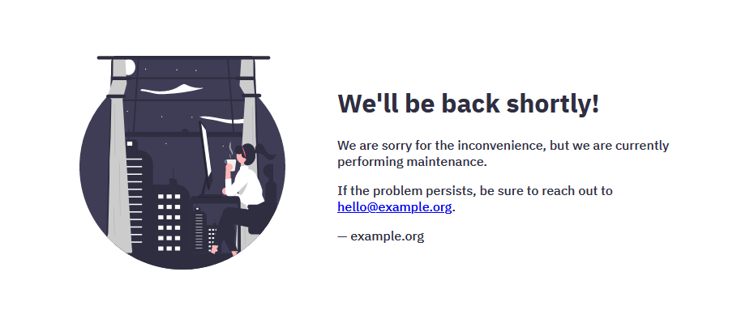
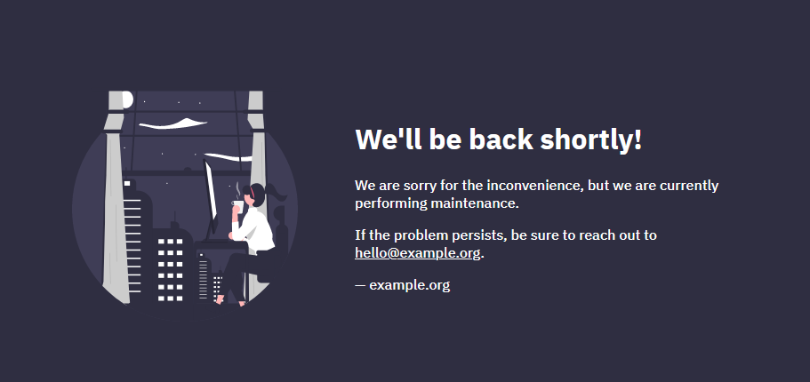

# default-backend

A default HTTP backend that is to be served from ingress controllers, preferably running on Kubernetes,
or any other default HTTP backend, e.g., the fallback of an NGINX reverse proxy.

It looks like this:



and even has a built-in, preference-detecting dark mode:



It uses CSS's `@media (prefers-color-scheme: dark)` to switch between light and dark!

It also responds with an HTTP 404 on the root URL, making it a hard-fail backend instead of a soft-failure semantic 404 served with an HTTP 200 status code. This behaviour is up to preference though, it can be changed, see the section below.

## Building

This is just your regular Golang app:

```
$ go mod download

$ go build -o ./server

$ ./server
```

or using Docker

```
$ docker build .
```

which will produce a small, handy, and easy to secure, distroless image (<https://github.com/GoogleContainerTools/distroless>).

If you need a shell, build the alpine image using

```
$ docker build ./Dockerfile.debug
```

## Templating custom values

The website served here is highly customizable, thanks to `spf13/viper` and environment variables or configuration files.
The easiest way to customize might be ENV variables, so here are the keys and their defaults:

```sh
STATIC_ASSETS_PATH="./public/"

PAGE_TITLE="Oops!"

TITLE="We'll be back shortly!"

IMAGE_ENABLED=true
IMAGE_URL="public/asset.svg"

BODY="We are sorry for the inconvenience."

CONTACT_ENABLED=true
CONTACT_BODY="You can always reach us at <a href=\"mailto:hello@example.org\">hello@example.org</a>"

AUTHOR_ENABLED=true
AUTHOR_NAME="example.org"
AUTHOR_URL="example.org"

DARK_THEME_ENABLED=true

TEXT_COLOR="#2f2e41"
BACKGROUND_COLOR="#fff"

CUSTOM_CODE=false
CUSTOM_HTML=""
CUSTOM_CSS=""

STATUS_CODE=404
```

but you can also do this by YAML, which is arguably a lot nicer looking:

```yaml
staticAssetsPath: "./public/"
staticAssetsPrefix: "/public/"
pageTitle: "Oops!"
title: "We'll be back shortly!"
body: "We are sorry for the inconvenience."
author:
  enabled: true
  name: "example.org"
  url: "example.org"
image:
  enabled: true
  url: "public/asset.svg"
contact:
  enabled: true
  body: You can always reach us at <a href="mailto:hello@example.org">hello@example.org</a>
theme:
  textColor: "#2f2e41"
  color: "#fff"
  darkTheme:
    enabled: true
raw:
  enabled: false
  html: ""
  css: ""
```

This configmap gives you control over almost all aspects of the HTML page that is delivered to you. 
Most properties should be pretty self-explanatory, but note the `staticAssetsPath` property:
this is not relevant for the template itself but rather for the static file server that runs 
underneath to serve the small image. By default, this runs under the prefix `/public`, but it 
can be fully customized to fit your needs inside a container: When you mount files from a volume, 
make sure to converge the mount path and the configured `staticAssetsPath` and the `staticAssetPrefix`
property in case your image you'd like to serve your static assets from another location.

The dedicated mount point for a configmap file is `/etc/default-backend/config.yaml`. Do NOT mount into `/`,
as the default configmap is located there and you MUST NOT replace it, as it serves as the kernel for the configuration.

## Running the containers

As already mentioned, the default Dockerfile builds a distroless container, i.e., it has no shell you can access to perform
any other operation than running the application. If you need a shell for whatever reason, e.g., patch something
or plainly experiment, have a look at the `debug` tag: <https://github.com/zoomoid/default-backend/pkgs/container/default-backend%2Fdebug>. It builds an alpine linux image that has a shell ready to go!

## Usage with docker-compose

This is very straight-forward, just override the environment variables above from the docker-compose.yaml
and you are good to go. Same goes with just running from docker (or any other container runtime for that matter),
just override the respective environment variables

## Usage with Kubernetes

This small little page is intended to be used as the ingress controller's default backend. For NGINX Ingress this
can be done at installation time, e.g., in the helm values file, setting

```yaml
defaultBackend:
  enabled: true
  name: defaultbackend
  image:
    registry: ghcr.io
    image: zoomoid/default-backend
    tag: latest
    pullPolicy: IfNotPresent
    # nobody user -> uid 65534
    runAsUser: 65534
    runAsNonRoot: true
    readOnlyRootFilesystem: true
    allowPrivilegeEscalation: false
  ...
```

Note that for NGINX ingress, this deployment has [statically configured livenessProbes and readinessProbes
on `/healthz`](https://github.com/kubernetes/ingress-nginx/blob/8611ecb7c97ce286e2e171a7e6e6aa50d2398b0c/charts/ingress-nginx/templates/default-backend-deployment.yaml#L70). The server statically answers with HTTP 200 on this route.

For other ingress controllers you might have to deploy your own ingress and deployment for the default backend. Since Kubernetes >= 1.18, this can be done with this bit of YAML. Note that your might want to add more specification to deployment, service, and ingress. In particular, handling TLS for this backend might get complicated if not properly done by your ingress controller or you provided a certificate in advance,
as solutions like cert-manager require a predefined hostname to get certificates for.

```yaml
---
apiVersion: apps/v1
kind: Deployment
metadata:
  name: default-backend
spec:
  selector:
    matchLabels:
      app.kubernetes.io/name: default-backend
  template:
    metadata:
      labels:
        app.kubernetes.io/name: default-backend
    spec:
      containers:
        - name: default-backend
          image: ghcr.io/zoomoid/default-backend:latest
          ports:
            - containerPort: 8080
---
apiVersion: v1
kind: Service
metadata:
  name: default-backend
spec:
  selector:
    app.kubernetes.io/name: default-backend
  ports:
    - port: 80
      targetPort: 8080
---
apiVersion: networking.k8s.io/v1
kind: Ingress
metadata:
  name: default-backend
spec:
  backend:
    service:
      name: default-backend
      port:
        number: 80
```

### Configuration

You can override the default configuration with a configmap of your liking, see the above section on that, like this:

```yaml
apiVersion: v1
kind: ConfigMap
metadata: 
  name: default-backend-config
  labels:
    app.kubernetes.io/name: default-backend
data:
  config.yaml: |-
    ---
    staticAssetsPath: "./public/"
    staticAssetsPrefix: "/public/"
    pageTitle: "Oops!"
    title: "We'll be back shortly!"
    body: "We are sorry for the inconvenience."
    author:
      enabled: true
      name: "example.org"
      url: "example.org"
    image:
      enabled: true
      url: "public/asset.svg"
    contact: 
      enabled: true 
      body: You can always reach us at <a href="mailto:hello@example.org">hello@example.org</a>
    theme:
      textColor: "#2f2e41"
      color: "#fff"
      darkTheme:
        enabled: true
    customCode:
      enabled: false
      html: ""
      css: ""
```

or by directly overriding the above specified ENV variables from either a configmap or directly inside the deployment spec.
You can mount the configmap from above into a file like this:

```yaml
apiVersion: apps/v1
kind: Deployment
metadata:
  name: default-backend
spec:
  selector:
    matchLabels:
      app.kubernetes.io/name: default-backend
  template:
    metadata:
      labels:
        app.kubernetes.io/name: default-backend
    spec:
      containers:
        - name: default-backend
          image: ghcr.io/zoomoid/default-backend:latest
          ports:
            - containerPort: 8080
          volumeMounts:
            - name: configmap
              mountPath: /etc/default-backend
      volumes:
        - name: configmap
          configMap:
            name: default-backend-config
            items:
              - key: config.yaml
                path: config.yaml
```